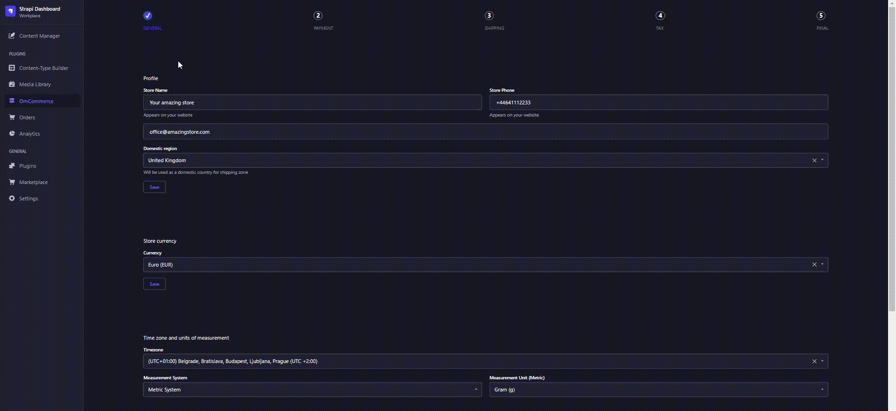
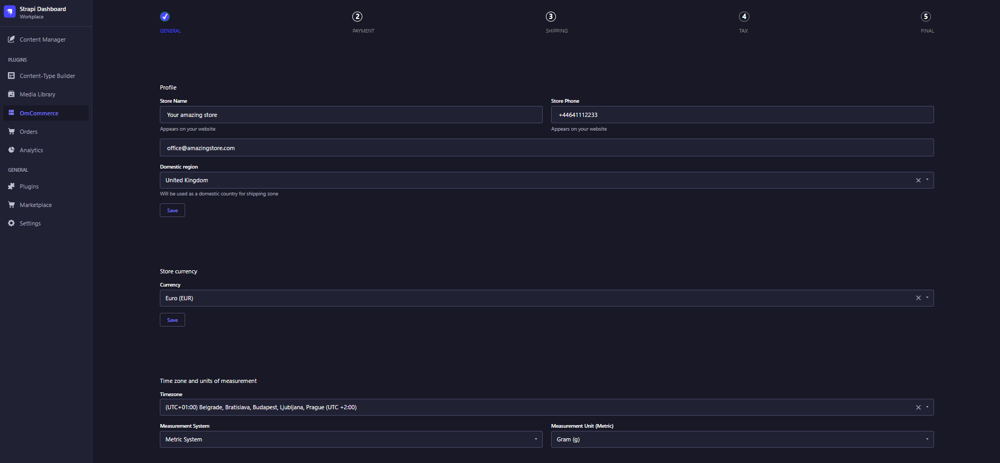

<div align="center">
  
</div>
<h1 align="center">OmCommerce for Strapi</h1>
<p align="center">The most customizable and user-friendly ecommerce plugin for Strapi.</p>
<p align="center">Set up your online store effortlessly and enjoy full customization options.</p>
<p align="center">Seamless integration with a developer-friendly API for any frontend app.</p>

<br />

<p align="center">
  <a href="https://www.npmjs.org/package/omcommerce">
    
  </a>
  <a href="https://www.npmjs.org/package/omcommerce">
    
  </a>
<a href="https://github.com/omomcode/omcommerce_production/actions/workflows/ci.yml/badge.svg">

</a>
<a href="https://github.com/omomcode/omcommerce_production/actions/workflows/eslint.yml/badge.svg">

</a>
</p>

<br>

<div style="margin: 20px 0" align="center">
  
</div>

<p align="center">
  OmCommerce Plugin provides a comprehensive ecommerce solution for [Strapi Headless CMS](https://github.com/strapi/strapi) users. Enjoy a hassle-free setup, full customization capabilities, and a developer-friendly API for easy integration with any frontend app.
</p>

### Table of Contents
1. [✨ Features](#-features)
2. [⏳ Installation](#-installation)
3. [🔧 Configuration](#-configuration)
4. [🕸️ Public API specification](#%EF%B8%8F-public-api-specification)
   - [Settings](#41-settings)
      - [Store Profile](#411-store-profile)
      - [Currency](#412-currency)
      - [Time Zone and Units of Measurement](#413-time-zone-and-units-of-measurement)
      - [Legal pages](#414-legal-pages)
      - [Social](#415-social)
   - [Content](#42-content)
      - [Product](#421-product)
      - [Categories](#422-categories)
      - [Subcategories](#423-subcategories)
   - [Payment](#43-payment)
      - [Calculate Shipping](#431-calculate-shipping)
      - [Payment Gateway](#432-payment-gateway)
         - [PayPal](#4321-paypal)
            - [PayPal Settings](#43211-paypal-settings)
            - [PayPal Create Order](#43212-paypal-create-order)
            - [PayPal Order Capture](#43213-paypal-order-capture)
6. [🧩 Examples](#-examples)
7. [🤝 Contributing](#-contributing)
8. [👨‍💻 Community support](#-community-support)

## ✨ Features

- **General settings:** Streamline all crucial settings in one centralized location.
- **Shipping:** Define shipping zones, rates, and default packages effortlessly. Easily calculate shipping costs based on geographical areas.
- **Taxes:** Effectively manage the collection of taxes on products.
- **Legal pages:** Establish all necessary legal pages for an online store or generate them effortlessly.  
- **Payment gateway:** Seamlessly connect to a supported payment gateway in just a few clicks.
- **Orders:** Efficiently monitor online purchases and orders for a comprehensive overview.
- **Product creation :** Utilize an extensive and easily customizable content-type for creating and managing products with flexibility.
- **Analytics :** Keep a close eye on store performance with robust analytics tracking.

## ⏳ Installation

Use **npm** to install this plugin within your Strapi project (recommended).

[Refer to this doc to install npm](https://docs.npmjs.com/cli/v6/commands/npm-install)

```bash
npm i omcommerce
```

After successful installation you would need to build a fresh package that includes the OmCommerce plugin UI. Please execute the commands below:

```bash
# with yarn (option 1)
$ yarn build
$ yarn develop

# with npm (option 2)
$ npm run build
$ npm run develop
```

The **OmCommerce** plugin should appear in the **Plugins** section of Strapi sidebar after you run app again.

## 🔧 Configuration

Setting up the **OmCommerce** plugin is a breeze with our step-by-step guide, accessible by clicking on OmCommerce in the left-side navigation menu.

<div style="margin: 20px 0" align="center">
  
</div>

### General Configuration

Fine-tune your store with general settings that apply across all components. Some parameters are exposed to the public API. Ensure your currency aligns with your merchant account; modifications can be made at: **Settings -> OMCOMMERCE -> Store Settings**.

### Payment Setup

Effortlessly receive payments by providing your credentials from the payment provider. Adjust payment settings anytime at: **Settings -> OMCOMMERCE -> Payment**.

### Shipping Management

Define shipping zones, rates based on conditions, and default packages. Set up shipping preferences at: **Settings -> OMCOMMERCE -> Shipping**.

### Tax Customization

Tailor your tax settings and conditions to suit your business needs. Access tax settings at: **Settings -> OMCOMMERCE -> Taxes**.

### Additional Settings

Explore supplementary settings and configurations at: **Settings -> OMCOMMERCE**.

Now, let's build your online store with precision and ease!

## 🕸️ Public API specification

#### 4.1 Settings

##### 4.1.1 Store Profile
- **Endpoint:** `GET <host>/omcommerce/profile/find`
- **Example Response Body:**
    ```json
    {
        "id": 1,
        "name": "Your amazing store",
        "phone": "+44641112233",
        "email": "info@amazingstore.com",
        "region": "GB"
    }
    ```

##### 4.1.2 Currency
- **Endpoint:** `GET <host>/omcommerce/currency/find`
- **Example Response Body:**
    ```json
    {
        "id": 1,
        "currency": "GBP",
        "createdAt": "2023-11-10T15:24:59.757Z",
        "updatedAt": "2023-11-11T00:19:10.886Z"
    }
    ```
##### 4.1.3 Time Zone and Units of Measurement
- **Endpoint:** `GET <host>/omcommerce/timezone/find`
- **Example Response Body:**
    ```json
    {
        "id": 1,
        "timezone": "GMT Standard Time",
        "measurement": "Metric",
        "unit": "g",
        "lengthUnit": "cm",
        "createdAt": "2023-11-10T15:24:59.761Z",
        "updatedAt": "2023-11-11T00:19:10.011Z"
    }
    ```
##### 4.1.4 Legal Pages

- **Endpoint:** `GET <host>/omcommerce/legal/find`

- **Example Response Body:**
    ```json
    {
        "id": 1,
        "enabled": false,
        "createdAt": "2023-11-12T02:07:16.523Z",
        "updatedAt": "2023-11-12T15:31:48.391Z",
        "publishedAt": "2023-11-12T02:07:18.086Z",
        "returnPolicy": "5",
        "privacyPolicy": "<!DOCTYPE html>\n<html lang=\"en\">\n\n<head>\n    <meta charset=\"UTF-8\">\n    <meta http-equiv=\"X-UA-Compatible\" content=\"IE=edge\">\n    <meta name=\"viewport\" content=\"width=device-width, initial-scale=1.0\">\n    <title>Privacy Policy</title>\n</head>\n\n<!-- ... Privacy Policy HTML content ... -->\n\n</html>",
        "termsOfService": "<!DOCTYPE html>\n<html lang=\"en\">\n\n<head>\n    <meta charset=\"UTF-8\">\n    <meta http-equiv=\"X-UA-Compatible\" content=\"IE=edge\">\n    <meta name=\"viewport\" content=\"width=device-width, initial-scale=1.0\">\n    <title>Terms of Service</title>\n</head>\n\n<!-- ... Terms of Service HTML content ... -->\n\n</html>",
        "shippingPolicy": "<!DOCTYPE html>\n<html lang=\"en\">\n\n<head>\n    <meta charset=\"UTF-8\">\n    <meta http-equiv=\"X-UA-Compatible\" content=\"IE=edge\">\n    <meta name=\"viewport\" content=\"width=device-width, initial-scale=1.0\">\n    <title>Shipping Policy</title>\n</head>\n\n<!-- ... Shipping Policy HTML content ... -->\n\n</html>",
        "returnRules": "5",
        "returnShipping": "5",
        "restockingFee": 5,
        "returnWindow": "30 days",
        "returnShippingCost": "Customer provides return shipping"
    }
    ```

##### 4.1.5 Social

- **Endpoint:** `GET <host>/omcommerce/social/find/1`

- **Example Response Body:**
    ```json
    {
        "id": 1,
        "instagram_enabled": true,
        "facebook_enabled": true,
        "pinterest_enabled": true,
        "x_enabled": true,
        "tiktok_enabled": true,
        "instagram": "YourInstagramAccount",
        "facebook": "YourFacebookAccount",
        "pinterest": "YourPinterestAccount",
        "x": "YourXAccount",
        "tiktok": "YourTikTokAccount",
        "createdAt": "2023-11-12T15:35:30.929Z",
        "updatedAt": "2023-11-12T15:35:30.929Z"
    }
    ```
    
#### 4.2 Content

##### 4.2.1 Product
- **Endpoint:** `GET <host>/omcommerce/product/find`
- **Example Response Body:**
    ```json
    [
        {
            "id": 1,
            "description": "The most amazing green tea you'll ever taste",
            "amount_currency_code": "GBP",
            "amount_value": 20,
            "amount_value_converted": 22.82 // Equivalent value in your converted currency. See our currency conversion
            "amount_currency_code_converted": "EUR",
            "Quantity": 10, // Available quantity
            "weight": 0.26, // Weight of the product. Used in shipping calculation if the condition is based on weight
            "measurement_unit": "g", // Measurement unit for weight
            "title": "Amazing Green Tea",
            "slug": "amazing-green-tea", // Use to improve SEO
            "media": [
                {
                    "id": 2,
                    "name": "green-tea_400-237a32b.jpg",
                    "alternativeText": null,
                    "caption": null,
                    "width": 400,
                    "height": 363,
                    "formats": {
                        "thumbnail": {
                            "ext": ".jpg",
                            "url": "/uploads/thumbnail_green_tea_400_237a32b_392a82a7ad.jpg",
                            "hash": "thumbnail_green_tea_400_237a32b_392a82a7ad",
                            "mime": "image/jpeg",
                            "name": "thumbnail_green-tea_400-237a32b.jpg",
                            "path": null,
                            "size": 8.06,
                            "width": 172,
                            "height": 156
                        }
                    },
                    "hash": "green_tea_400_237a32b_392a82a7ad",
                    "ext": ".jpg",
                    "mime": "image/jpeg",
                    "size": 32.52,
                    "url": "/uploads/green_tea_400_237a32b_392a82a7ad.jpg",
                    "previewUrl": null,
                    "provider": "local",
                    "provider_metadata": null,
                    "folderPath": "/",
                    "createdAt": "2023-11-11T18:53:04.720Z",
                    "updatedAt": "2023-11-11T18:53:04.720Z"
                }
            ],
            "categories": [
                {
                    "id": 2,
                    "title": "Tea",
                    "description": "High-quality tea",
                    "createdAt": "2023-11-11T18:54:30.683Z",
                    "updatedAt": "2023-11-11T18:54:59.319Z",
                    "publishedAt": "2023-11-11T18:54:59.317Z"
                }
            ]
        }
    ]
    ```
##### 4.2.2 Categories
- **Endpoint:** `GET <host>/omcommerce/categorys/find`
- **Example Response Body:**
    ```json
    [
        {
            "id": 2,
            "title": "Tea",
            "description": "High-quality tea",
            "img": null,
        }
    ]
    ```

##### 4.2.3 Subcategories
- **Endpoint:** `GET <host>/omcommerce/subcategories/find`
- **Example Response Body:**
    ```json
    [
        {
            "id": 1,
            "title": "Organic"
        }
    ]
    ```

#### 4.3 Payment

##### 4.3.1 Calculate Shipping
- **Endpoint:** `POST <host>/omcommerce/shippingcalculator/calculate`
- **Example Request Body:**
    ```json
    {
        "data": {
            "cart": [
                {
                    "id": "1", // The unique identifier obtained from the `product/find` endpoint
                    "quantity": "1" // The quantity of the items you want to purchase
                }
            ],
            "country_code": "GB" // The country code representing the customer's location
        }
    }
    ```
- **Example Response:**
    ```json
    0 // The calculated shipping cost based on the shipping zone of the customer's country. Currency may vary depending on the shipping rates and conditions for that zone.
    ```

##### 4.3.2 Payment Gateway

###### 4.3.2.1 PayPal

###### 4.3.2.1.1 PayPal Settings
- **Endpoint:** `GET <host>/omcommerce/paypal/settings`
- **Example Response Body:**
    ```json
    {
        "live_paypal_client_id": "XXXXXXXXXXXXXXXXXXXXXXXXXX", // Required for setting up PayPal buttons in production. Use the provided live client ID. If 'live' is false, use the "test" client ID instead.
        "live": true  // If 'live' is true, the system is in production mode. If 'live' is false, the system is in sandbox mode for testing purposes.
    }
  
###### 4.3.2.1.2 PayPal Create Order

- **Endpoint:** `POST <host>/omcommerce/payment/orders`
- **Example Request Body:**
    ```json
    {
        "data": {
            "cart": [
                {
                    "id": "1", // The unique identifier obtained from the `product/find` endpoint
                    "quantity": "1" // The quantity of the items you want to purchase
                }
            ],
            "country_code": "GB" // The country code representing the customer's location
        }
    }
    ```
- **Example Response Body:**
    ```json
    {
        "id": "XXXXXXXXXXXX",
        "status": "CREATED",
        "links": [
            {
                "href": "https://api.sandbox.paypal.com/v2/checkout/orders/XXXXXXXXXXXX",
                "rel": "self",
                "method": "GET"
            },
            {
                "href": "https://www.sandbox.paypal.com/checkoutnow?token=XXXXXXXXXXXX",
                "rel": "approve",
                "method": "GET"
            },
            {
                "href": "https://api.sandbox.paypal.com/v2/checkout/orders/XXXXXXXXXXXX",
                "rel": "update",
                "method": "PATCH"
            },
            {
                "href": "https://api.sandbox.paypal.com/v2/checkout/orders/XXXXXXXXXXXX/capture",
                "rel": "capture",
                "method": "POST"
            }
        ]
    }
    ```

###### 4.3.2.1.3 PayPal Order Capture

- **Endpoint:** `POST <host>/omcommerce/payment/capture`
- **Example Request Body:**
    ```json
    {
        "orderID": "XXXXXXXXXXXX" // Order ID obtained from the previous call to create order
    }
    ```
- **Example Response Body:**
    ```json
    {
        "id": "XXXXXXXXXXXX",
        "status": "COMPLETED",
        "payment_source": {
            "paypal": {
                "email_address": "*****@gmail.com",
                "account_id": "************",
                "account_status": "UNVERIFIED",
                "name": {
                    "given_name": "****",
                    "surname": "******"
                },
                "address": {
                    "country_code": "**"
                }
            }
        },
        "purchase_units": [
            {
                "reference_id": "default",
                "shipping": {
                    "name": {
                        "full_name": "******** *******"
                    },
                    "address": {
                        "address_line_1": "*************",
                        "admin_area_2": "*********",
                        "postal_code": "*****",
                        "country_code": "**"
                    }
                },
                "payments": {
                    "captures": [
                        {
                            "id": "**************",
                            "status": "COMPLETED",
                            "amount": {
                                "currency_code": "***",
                                "value": "20.00"
                            },
                            "final_capture": true,
                            "seller_protection": {
                                "status": "ELIGIBLE",
                                "dispute_categories": [
                                    "ITEM_NOT_RECEIVED",
                                    "UNAUTHORIZED_TRANSACTION"
                                ]
                            },
                            "seller_receivable_breakdown": {
                                "gross_amount": {
                                    "currency_code": "***",
                                    "value": "20.00"
                                },
                                "paypal_fee": {
                                    "currency_code": "***",
                                    "value": "1.29"
                                },
                                "net_amount": {
                                    "currency_code": "***",
                                    "value": "18.71"
                                }
                            },
                            "links": [
                                {
                                    "href": "https://api.sandbox.paypal.com/v2/payments/captures/**************",
                                    "rel": "self",
                                    "method": "GET"
                                },
                                {
                                    "href": "https://api.sandbox.paypal.com/v2/payments/captures/**************/refund",
                                    "rel": "refund",
                                    "method": "POST"
                                },
                                {
                                    "href": "https://api.sandbox.paypal.com/v2/checkout/orders/5LM045300G326752U",
                                    "rel": "up",
                                    "method": "GET"
                                }
                            ],
                            "create_time": "************",
                            "update_time": "************"
                        }
                    ]
                }
            }
        ],
        "payer": {
            "name": {
                "given_name": "****",
                "surname": "******"
            },
            "email_address": "*****@gmail.com",
            "payer_id": "************",
            "address": {
                "country_code": "**"
            }
        },
        "links": [
            {
                "href": "https://api.sandbox.paypal.com/v2/checkout/orders/XXXXXXXXXXXX",
                "rel": "self",
                "method": "GET"
            }
        ]
    }
    ```


    
## 🧩 Examples

Want to see real-life examples of OmCommerce in action? Drop us a line at info@omomcode.com, and we'll share some awesome online stores powered by OmCommerce.

## 🤝 Contributing

<div>
  <a href="https://sharing.clickup.com/tl/omom">
    
  </a>
  <a href="https://sharing.clickup.com/b/omom">
    
  </a>
</div>

Feel free to fork and make a Pull Request to this plugin project. All the input is warmly welcome!

- Clone repository

    ```
    git clone git@github.com:omomcode/omcommerce.git
    ```

- Create a soft link in your strapi project to plugin build folder

    ```sh
    ln -s <...>/omcommerce/build <...>/strapi-project/src/plugins/omcommerce 
    ```

- Run build command 

    ```ts
    // option 1
    yarn develop

    // option 2
    yarn build
    yarn start
    ```
## 👨‍💻 Community support

For general help using Strapi, please refer to [the official Strapi documentation](https://strapi.io/documentation/). For additional help, you can use one of these channels to ask a question:

- [GitHub](https://github.com/omomcode/omcommerce/issues) (Bug reports, Contributions, Questions and Discussions)
- [E-mail](mailto:info@omomcode.com) - we will respond back as soon as possible

## 📝 License

[MIT License](LICENSE.md) Copyright (c) [Om om code](https://omomcode.com/)
